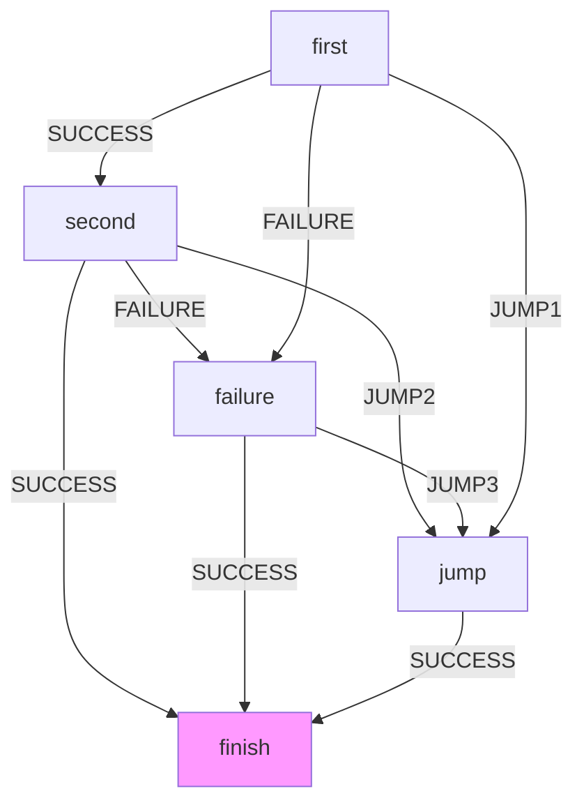

# taskflow

```mermaid
        graph TD
        second --> |SUCCESS|finish
        second --> |FAILURE|failure
        second --> |JUMP2|jump
        failure --> |JUMP3|jump
        failure --> |SUCCESS|finish
        jump --> |SUCCESS|finish
        first --> |SUCCESS|second
        first --> |FAILURE|failure
        first --> |JUMP1|jump
        style finish fill:#f9f
```